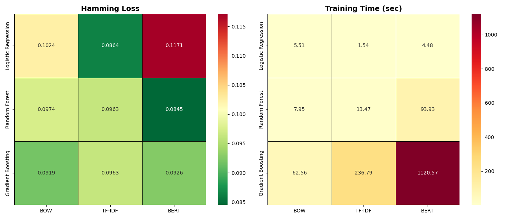
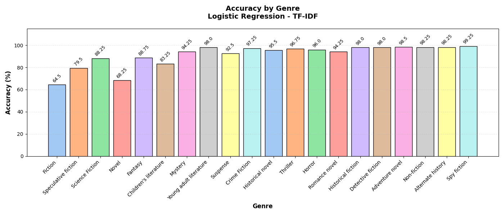
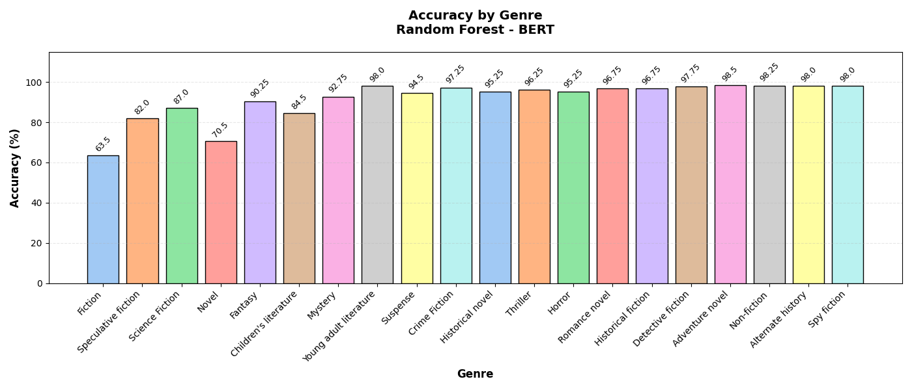

# Book Genre Prediction using Classical Machine Learning

This project tackles **multi-label classification** of book genres based on textual summaries. We compare three classifiers:

- Logistic Regression
- Random Forest
- Gradient Boosting

combined with three different text representation approaches:

- Bag-of-Words (BOW)
- TF-IDF
- BERT embeddings

The goal is to understand which combination gives the best trade-off between performance and training time.

## Dataset

- **Source**: Book summaries with multi-label genres (loaded via `datasets` library from Hugging Face)
- **Size**: 16,559 books

## Methodology

### Text Preprocessing
- Tokenization and stopword removal
- Feature extraction:
  - `CountVectorizer`
  - `TfidfVectorizer`
  - Pre-trained `bert-base-uncased` embeddings

### Models
- Classifiers wrapped with `MultiOutputClassifier` for multi-label support
- Evaluation metrics: Hamming Loss + per-genre accuracy

### Experiments
9 combinations were tested (3 classifiers × 3 feature sets).

## Results

### Hamming Loss & Training Time

**Key findings**:
- Best Hamming Loss: **Random Forest + BERT**
- Fastest models: **Logistic Regression**

### Per-Genre Accuracy (selected best combinations)

**Gradient Boosting + BOW**  

**Logistic Regression + TF-IDF**  

**Random Forest + BERT**  

Most genres achieve 90–98% accuracy in the top models. “Fiction” remains the most difficult to recognize class (~60%).
